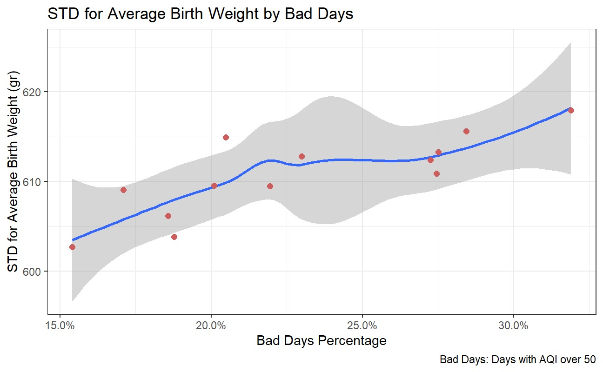
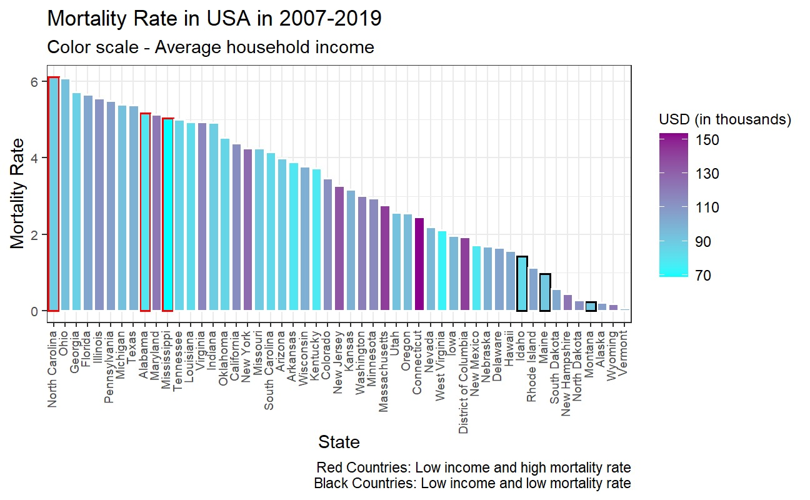
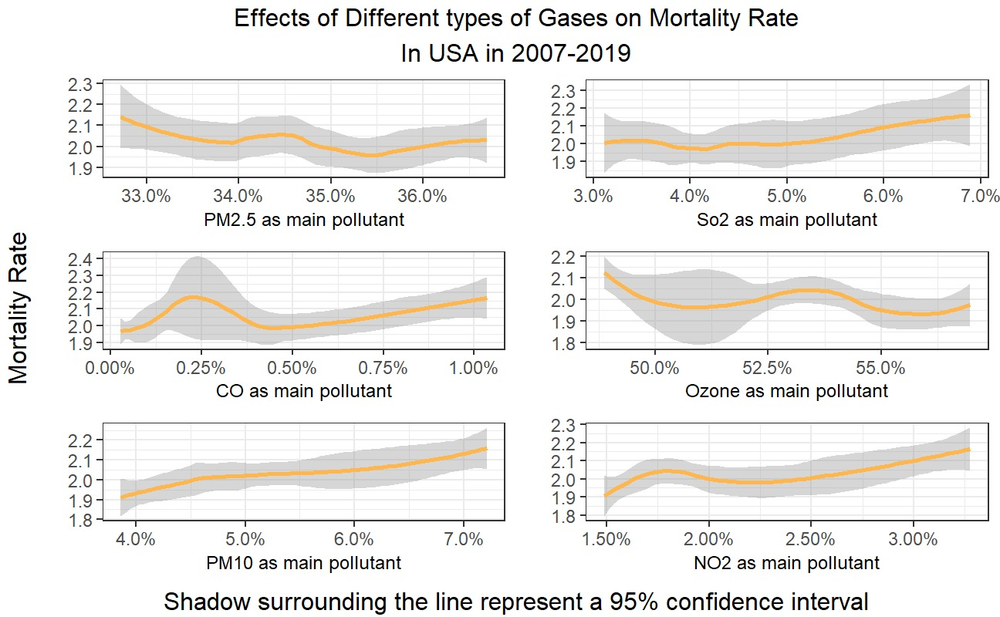

## 1. Introduction
In the last two decades, the quality of air in our living spaces has declined following a rampant increase in production and manufacturing due to the rise of global consumerism. In this project, we will research whether the quality of air has an immediate effect on health outcomes among pregnant women and infants.

This type of research will help determine if and how society can change its production and manufacturing methods to improve health among its members.

In recent years both the volume and effect of mass production and standards of tracking and storing data have increased which in turn provides accessible information with critical importance to be explored.

This research will be done by analyzing data provided by several US agencies and discovering and understanding relations between different data points leading to conclusions. All sets contain data collected in the United States from 2003 to 2020.

## 2. Data

We will use three data sets to research the topic.

**Air quality data:**
a data set detailing the air quality in the United States in 2003-2020.
Data are available by state and year. 
The set contains:
- different types of chemical compounds and their prevalence in the air.
- an Index that indicates the quality of air, denoted by AQI.
- count of days concerning varying levels of air quality.
Further information about the data dimensions and source can be found in the README appendix.

**Infant birth data:**
a data set detailing birth and fertility information in the United States in 2007-2020.
Data are available by state, year of birth and a variety of statistical information regarding infant measurements.
The data contains:
- Number of births and fertility rates.
- Division of cases by mother's age.
- weight and other information regarding the distribution of weight by different categories.
Further information about the data dimensions and source can be found in the README appendix.

**Infant death data:**
a data set detailing, births, health complications, deaths, and causes of death among babies under one year of age as well as their mothers in the United States in 2007-2019.
The data contains:
- Division of cases by mother's age
- Chapter code which indicates the health complication/cause of death.
- number of deaths in proportion to the number of births.
Further information about the data dimensions and source can be found in the README appendix.

 
The graph aims to demonstrate how fluctuations in the percentage of "bad days" correlate with the variability in average birth weight. 
 
 

 
The graph visually compares the mortality rates across different U.S. states. The height of each bar indicates the mortality rate for that particular state. The states are ordered along the x-axis, allowing for a quick comparison of mortality rates from one state to another.
 
 

 
The graph demonstrates a correlation between the prevalence of different types of gases to the birth weight of infants.
Although all averages seem to be considered healthy weights for newborns, there seems to be a trend for some gases like So2 and PM2.5.
Exploring Morbidity in infants and how it relates to weight could grant us vital information regarding the effects of air quality on an infant's health.
 
 

## 4. Data analysis plan
To answer our research question we will use air quality data (explanatory, X) to explore correlating health outcomes in infants and pregnant women (response, Y). results in different states and different years will be used as comparison groups.

To answer our question we will use data visualization and data manipulation methods such as plotting, mutating, pivoting, building statistical models, and interpreting the results.
